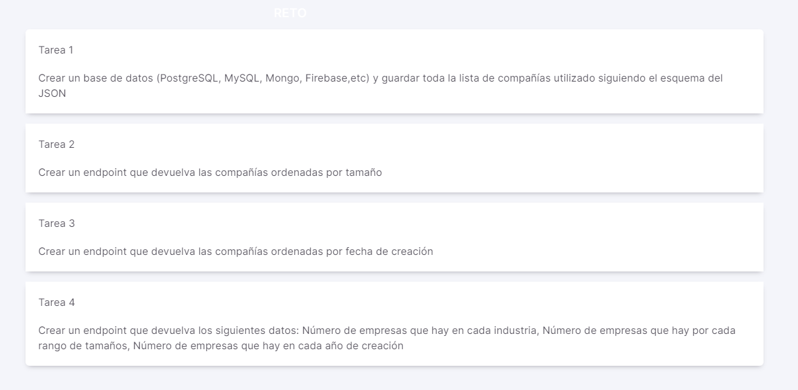

## Tasks Hackaton 2022 Jump2Digital

I created a spring project in order to solve the different tasks asked in the hackaton 2022.
There are asked to create a DB with the objects inside a json file and then create a few endpoints to access the data and make stadistics queries.

### Task 1

In this task first I've created a db schema using MySQL workbench, and then I've used a Java IDLE to create the entity and repository for the DB.
After that, I've created a rest-controller and a service so I can access and manipulate the data. In the main I've used the command-line-runner method to feed the db with the json file provided using the save method created in the service.
I've checked if everything has gone correctly with Postman by the endpoint I've already created to check all from the DB(get url /all-companies).

### Task 2

I've created a native query in the repository in order to get all companies in the DB grouped by size in descendant order. After that, I've created a method in the service and then in the controller to access this data. Also checked in Postman(get url /by-size).

### Task 3

For this I've added a simple JPA query in the repository to get all companies ordered by founded date. Also created a service and a controller method, checked in Postman(get url /get-companies-by-founded).

### Task 4

Here I've created three JPQL queries in order to get a list of objects arrays containing the info asked in the task. 
The first query return the number of companies by industry, the second return the number of companies by size and the last the number of companies by the founded date.
Also created a method in the service that switch between the three queries according to the value of a string method argument. In the controller I've asked to introduce as a request parameter a String so with the same endpoint you can access one of the three queries at time.
Checked in Postman(get url /count-by).

### Postman Collection

~~~~
{
	"info": {
		"_postman_id": "dfcad23f-9f41-4de9-84cc-ce65898f4f22",
		"name": "hackaton2022",
		"schema": "https://schema.getpostman.com/json/collection/v2.1.0/collection.json",
		"_exporter_id": "23789220"
	},
	"item": [
		{
			"name": "Get All Companies request",
			"request": {
				"method": "GET",
				"header": [],
				"url": {
					"raw": "http://localhost:8082/all-companies",
					"protocol": "http",
					"host": [
						"localhost"
					],
					"port": "8082",
					"path": [
						"all-companies"
					]
				}
			},
			"response": []
		},
		{
			"name": "Get All Companies grouped and ordered by size",
			"request": {
				"method": "GET",
				"header": [],
				"url": {
					"raw": "http://localhost:8082/by-size",
					"protocol": "http",
					"host": [
						"localhost"
					],
					"port": "8082",
					"path": [
						"by-size"
					]
				}
			},
			"response": []
		},
		{
			"name": "Get All Companies grouped by founded",
			"request": {
				"method": "GET",
				"header": [],
				"url": {
					"raw": "http://localhost:8082/get-companies-by-founded",
					"protocol": "http",
					"host": [
						"localhost"
					],
					"port": "8082",
					"path": [
						"get-companies-by-founded"
					]
				}
			},
			"response": []
		},
		{
			"name": "Get Count of Companies group by Industry",
			"request": {
				"method": "GET",
				"header": [],
				"url": {
					"raw": "http://localhost:8082/count-by?type=industry",
					"protocol": "http",
					"host": [
						"localhost"
					],
					"port": "8082",
					"path": [
						"count-by"
					],
					"query": [
						{
							"key": "type",
							"value": "industry"
						}
					]
				}
			},
			"response": []
		},
		{
			"name": "Get Count of Companies group by Size",
			"request": {
				"method": "GET",
				"header": [],
				"url": {
					"raw": "http://localhost:8082/count-by?type=size",
					"protocol": "http",
					"host": [
						"localhost"
					],
					"port": "8082",
					"path": [
						"count-by"
					],
					"query": [
						{
							"key": "type",
							"value": "size"
						}
					]
				}
			},
			"response": []
		},
		{
			"name": "Get Count of Companies group by founded",
			"request": {
				"method": "GET",
				"header": [],
				"url": {
					"raw": "http://localhost:8082/count-by?type=founded",
					"protocol": "http",
					"host": [
						"localhost"
					],
					"port": "8082",
					"path": [
						"count-by"
					],
					"query": [
						{
							"key": "type",
							"value": "founded"
						}
					]
				}
			},
			"response": []
		}
	]
}
~~~~